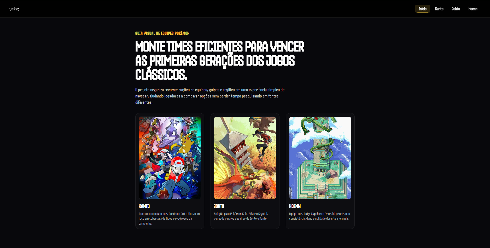
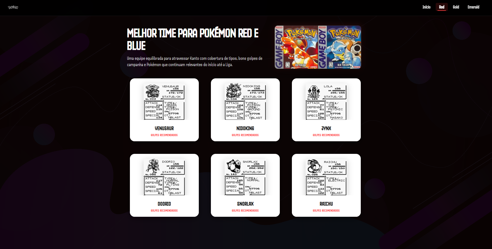
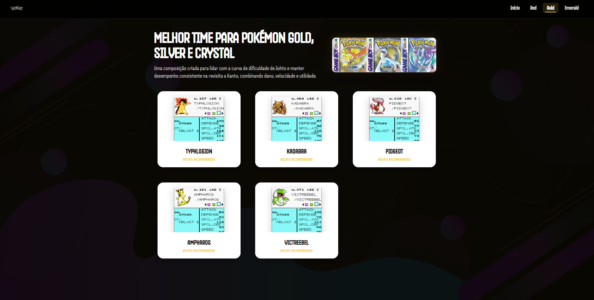
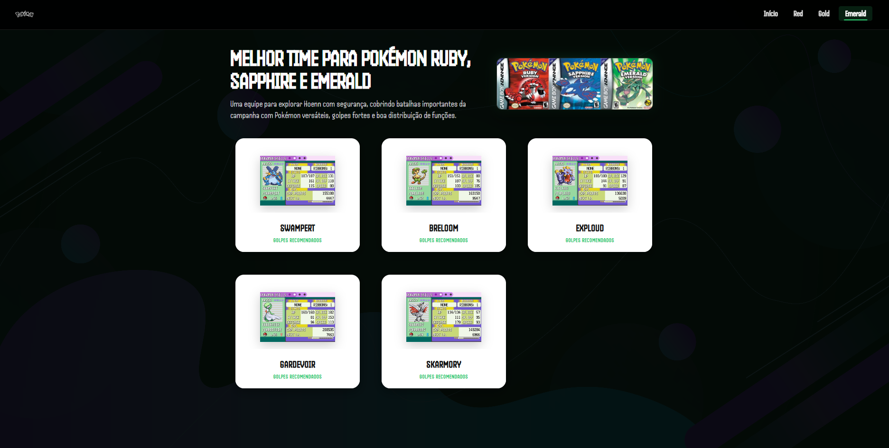

# Pokémon Teams by Generation

Landing Page desenvolvida para ajudar jogadores a montarem os melhores times para as versões clássicas Pokémon Red, Pokémon Gold e Pokémon Emerald.

O projeto reúne recomendações de equipes, sugestões de golpes e organização por geração, permitindo que jogadores comparem opções e planejem suas jornadas de forma mais estratégica.

Além de funcionar como uma ferramenta de consulta para fãs da franquia, o projeto também demonstra conhecimentos em desenvolvimento Front-End, HTML semântico, CSS responsivo, organização de assets e construção de interfaces focadas em experiência do usuário.

## Demonstração

- **Deploy:** https://site-seven-blue-98.vercel.app
- **Repositório:** https://github.com/phjsilva/site

## Problema Resolvido

Jogadores que iniciam ou revisitam Pokémon Red, Gold e Emerald frequentemente têm dúvidas sobre quais Pokémon utilizar durante a jornada principal.

Este projeto centraliza sugestões de equipes equilibradas para cada geração, oferecendo uma referência rápida e visual para auxiliar na tomada de decisão sem a necessidade de consultar múltiplas fontes.

## Funcionalidades

- Recomendações de times para Pokémon Red, Gold e Emerald.
- Navegação entre gerações através da Landing Page.
- Cards visuais para cada Pokémon.
- Lista de golpes recomendados.
- Organização de conteúdo por geração.
- Interface simples e intuitiva.
- Estrutura estática otimizada para deploy.

## Tecnologias Utilizadas

- HTML5
- CSS3
- Google Fonts
- Git
- GitHub
- Vercel

## Estrutura do Projeto

```text
.
├── index.html
├── style.css
│
├── imgp/
│
├── red/
│   ├── gen1.html
│   ├── gen1.css
│   └── img/
│
├── gold/
│   ├── gen2.html
│   ├── gen2.css
│   └── img_gold/
│
├── eme/
│   ├── gen3.html
│   ├── gen3.css
│   └── imgeme/
│
└── README.md
```

## Decisões Técnicas

- Separação das páginas por geração para facilitar manutenção e escalabilidade.
- Utilização de HTML semântico para melhorar acessibilidade e organização do código.
- Assets organizados por contexto para simplificar o gerenciamento do projeto.
- Estrutura independente de frameworks, priorizando o domínio dos fundamentos do Front-End.

## Aprendizados

Durante o desenvolvimento deste projeto foram praticados conceitos como:

- Estruturação de páginas utilizando HTML semântico.
- Organização de projetos Front-End.
- Criação de layouts responsivos com CSS.
- Utilização de Flexbox.
- Versionamento de código com Git e GitHub.
- Publicação de aplicações utilizando Vercel.

## Melhorias Futuras

- Implementar busca por Pokémon.
- Adicionar filtros por tipo.
- Melhorar a responsividade das páginas internas.
- Adicionar descrições estratégicas para cada integrante da equipe.
- Criar páginas individuais para cada Pokémon.
- Melhorar acessibilidade e navegação por teclado.

## Screenshots

```markdown







```

## 👨‍💻 Autor

Pedro Silva

- GitHub: https://github.com/phjsilva
- LinkedIn: https://www.linkedin.com/in/pedro-silva-3b5869380
